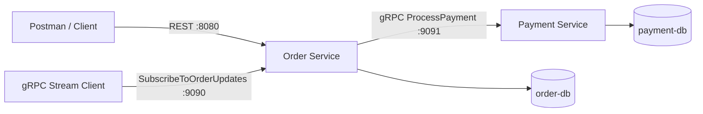

# Order Payment System (Assignment 2 gRPC)

## Repository Links (fill with your real GitHub URLs)
- Proto repository: `https://github.com/<your-username>/order-payment-protos`
- Generated code repository: `https://github.com/<your-username>/order-payment-generated`

## Architecture


## Ports
- `order-service` REST: `8080`
- `order-service` gRPC streaming server: `9090`
- `payment-service` REST (optional for debug): `8081`
- `payment-service` gRPC server: `9091`
- `order-db`: `5432`
- `payment-db`: `5433`

## Run
```powershell
cd C:\Users\toreh\OneDrive\Desktop\order-payment-system
docker compose up -d --build
```

Stop:
```powershell
docker compose down
```

## External REST API (Order Service)
- `POST /orders`
- `GET /orders`
- `GET /orders/{id}`
- `PATCH /orders/{id}`

The internal call from Order Service to Payment Service is gRPC (`ProcessPayment`).

## gRPC Contracts
- `payment.v1.PaymentService/ProcessPayment`
- `order.v1.OrderService/SubscribeToOrderUpdates` (server-side streaming)

## Postman Quick Test
1. `POST http://localhost:8080/orders`
```json
{
  "customer_id": "u1",
  "item_name": "book",
  "amount": 5000
}
```
2. `GET http://localhost:8080/orders`

## Streaming Demo (DB-driven updates)
1. Create order via REST.
2. Run stream client from `order-service`:
```powershell
cd C:\Users\toreh\OneDrive\Desktop\order-payment-system\order-service
go run ./cmd/stream-client <order_id> localhost:9090
```
3. Update order status in DB (or call cancel endpoint for pending order).
4. Stream client receives new status immediately from gRPC stream.
